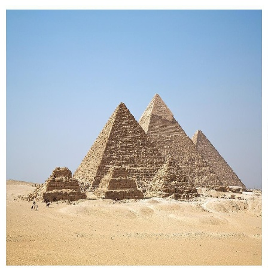

# AX-LLM


| Platform | Build Status |
| -------- | ------------ |
| AX650    | |

## 简介

**AX-LLM** 由 **[爱芯元智](https://www.axera-tech.com/)** 主导开发。该项目用于探索业界常用 **LLM(Large Language Model)** 在已有芯片平台上落地的可行性和相关能力边界，**方便**社区开发者进行**快速评估**和**二次开发**自己的 **LLM 应用**。

### 已支持芯片

- AX650A/AX650N
  - SDK ≥ v1.45.0_P31

### 已支持模型

- Qwen3-VL-2B-Instruct
- Qwen3-VL-4B-Instruct
- Qwen3-VL-8B-Instruct


## 源码编译
编译过程需要在板端进行，不能交叉编译。  
-  clone 本项目  
    ```shell
    git clone -b axcl-qwen3-vl https://github.com/AXERA-TECH/ax-llm.git
    cd ax-llm
    ```
- 编译  
  ```
  ./build.sh
  ```
- 正确编译后，`build/install/bin` 目录，应有以下文件（百度网盘中有预编译的可执行程序）
  ```
  $ tree install/bin/
    install/bin/
    ├── main
    ├── main_api
    ├── gradio_demo.py
    ├── openai_cli.py
    ├── post_config.json
    ├── run_image.sh
    ├── run_video.sh
    └── qwen3_tokenizer.txt
  ```
  
## 运行示例

### 1. 图像理解



1) 将 `build/install/bin`目录下的文件和编译好的模型都拷贝到爱芯板子上  
2) 运行 `run_image.sh`  
```shell
root@ax650 ~/Qwen3-VL-2B-Instruct-GPTQ-Int4 # bash run_image.sh 
[I][                            Init][ 156]: LLM init start
[I][                            Init][ 158]: Total CMM:4353 MB
[I][                            Init][  34]: connect http://127.0.0.1:8080 ok
bos_id: -1, eos_id: 151645
img_start_token: 151652
img_context_token: 151655
  3% | ██                                |   1 /  31 [0.01s<0.46s, 66.67 count/s] tokenizer init ok[I][                            Init][  26]: LLaMaEmbedSelector use mmap
  6% | ███                               |   2 /  31 [0.02s<0.34s, 90.91 count/s] embed_selector init ok[I][                            Init][ 201]: attr.axmodel_num:28
103% | ██████████████████████████████████ |  32 /  31 [34.03s<32.96s, 0.94 count/s] init vpm axmodel ok,remain_cmm(854 MB)[I][                            Init][ 266]: IMAGE_CONTEXT_TOKEN: 151655, IMAGE_START_TOKEN: 151652
[I][                            Init][ 309]: image encoder output float32

[I][                            Init][ 339]: max_token_len : 2047
[I][                            Init][ 344]: kv_cache_size : 1024, kv_cache_num: 2047
[I][                            Init][ 352]: prefill_token_num : 128
[I][                            Init][ 356]: grp: 1, prefill_max_token_num : 1
[I][                            Init][ 356]: grp: 2, prefill_max_token_num : 128
[I][                            Init][ 356]: grp: 3, prefill_max_token_num : 256
[I][                            Init][ 356]: grp: 4, prefill_max_token_num : 384
[I][                            Init][ 356]: grp: 5, prefill_max_token_num : 512
[I][                            Init][ 356]: grp: 6, prefill_max_token_num : 640
[I][                            Init][ 356]: grp: 7, prefill_max_token_num : 768
[I][                            Init][ 356]: grp: 8, prefill_max_token_num : 896
[I][                            Init][ 356]: grp: 9, prefill_max_token_num : 1024
[I][                            Init][ 356]: grp: 10, prefill_max_token_num : 1152
[I][                            Init][ 360]: prefill_max_token_num : 1152
[I][                            Init][ 372]: LLM init ok
[I][                            Init][ 374]: Left CMM:854 MB
Type "q" to exit, Ctrl+c to stop current running
prompt >> 描述这张图片
image >> assets/recoAll_attractions_1.jpg
[I][                     EncodeImage][ 440]: pixel_values size 1
[I][                     EncodeImage][ 441]: grid_h 24 grid_w 24
[I][                     EncodeImage][ 489]: image encode time : 237.778000 ms, size : 1
[I][                          Encode][ 532]: input_ids size:168
[I][                          Encode][ 540]: offset 15
[I][                          Encode][ 569]: img_embed.size:1, 294912
[I][                          Encode][ 583]: out_embed size:344064
[I][                          Encode][ 584]: input_ids size 168
[I][                          Encode][ 586]: position_ids size:168
[I][                             Run][ 607]: input token num : 168, prefill_split_num : 2
[I][                             Run][ 641]: input_num_token:128
[I][                             Run][ 641]: input_num_token:40
[I][                             Run][ 865]: ttft: 313.60 ms
这是一张在埃及沙漠中拍摄的风景照片。画面中，三座巨大的金字塔在晴朗的天空下矗立，它们是古埃及文明的象征。这些金字塔由巨大的石块堆叠而成，表面因岁月侵蚀而显得斑驳。在金字塔的前方，有几个人影在沙地上行走，这为整个场景提供了比例感和尺度感。整个场景充满了历史的厚重感和神秘的氛围。

[N][                             Run][ 992]: hit eos,avg 14.14 token/s
```

### 2. 视频理解

1) 将 `build/install/bin`目录下的文件和编译好的模型都拷贝到爱芯板子上  
2) 运行 `run_video.sh`   
```shell
root@ax650 ~/Qwen3-VL-2B-Instruct-GPTQ-Int4 # bash run_video.sh 
[I][                            Init][ 156]: LLM init start
[I][                            Init][ 158]: Total CMM:7884 MB
[I][                            Init][  34]: connect http://127.0.0.1:8080 ok
bos_id: -1, eos_id: 151645
img_start_token: 151652
img_context_token: 151656
  3% | ██                                |   1 /  31 [0.01s<0.34s, 90.91 count/s] tokenizer init ok[I][                            Init][  26]: LLaMaEmbedSelector use mmap
  6% | ███                               |   2 /  31 [0.01s<0.23s, 133.33 count/s] embed_selector init ok[I][                            Init][ 201]: attr.axmodel_num:28
103% | ██████████████████████████████████ |  32 /  31 [32.37s<31.36s, 0.99 count/s] init vpm axmodel ok,remain_cmm(4385 MB)[I][                            Init][ 266]: IMAGE_CONTEXT_TOKEN: 151656, IMAGE_START_TOKEN: 151652
[I][                            Init][ 309]: image encoder output float32

[I][                            Init][ 339]: max_token_len : 2047
[I][                            Init][ 344]: kv_cache_size : 1024, kv_cache_num: 2047
[I][                            Init][ 352]: prefill_token_num : 128
[I][                            Init][ 356]: grp: 1, prefill_max_token_num : 1
[I][                            Init][ 356]: grp: 2, prefill_max_token_num : 128
[I][                            Init][ 356]: grp: 3, prefill_max_token_num : 256
[I][                            Init][ 356]: grp: 4, prefill_max_token_num : 384
[I][                            Init][ 356]: grp: 5, prefill_max_token_num : 512
[I][                            Init][ 356]: grp: 6, prefill_max_token_num : 640
[I][                            Init][ 356]: grp: 7, prefill_max_token_num : 768
[I][                            Init][ 356]: grp: 8, prefill_max_token_num : 896
[I][                            Init][ 356]: grp: 9, prefill_max_token_num : 1024
[I][                            Init][ 356]: grp: 10, prefill_max_token_num : 1152
[I][                            Init][ 360]: prefill_max_token_num : 1152
[I][                            Init][ 372]: LLM init ok
[I][                            Init][ 374]: Left CMM:4385 MB
Type "q" to exit, Ctrl+c to stop current running
prompt >> 描述这个视频
video >> assets/video
video/frame_0000.jpg
video/frame_0008.jpg
video/frame_0016.jpg
video/frame_0024.jpg
video/frame_0032.jpg
video/frame_0040.jpg
video/frame_0048.jpg
video/frame_0056.jpg
[I][                     EncodeImage][ 440]: pixel_values size 4
[I][                     EncodeImage][ 441]: grid_h 24 grid_w 24
[I][                     EncodeImage][ 489]: image encode time : 751.481018 ms, size : 4
[I][                          Encode][ 532]: input_ids size:600
[I][                          Encode][ 540]: offset 15
[I][                          Encode][ 569]: img_embed.size:4, 294912
[I][                          Encode][ 574]: offset:159
[I][                          Encode][ 574]: offset:303
[I][                          Encode][ 574]: offset:447
[I][                          Encode][ 583]: out_embed size:1228800
[I][                          Encode][ 584]: input_ids size 600
[I][                          Encode][ 586]: position_ids size:600
[I][                             Run][ 607]: input token num : 600, prefill_split_num : 5
[I][                             Run][ 641]: input_num_token:128
[I][                             Run][ 641]: input_num_token:128
[I][                             Run][ 641]: input_num_token:128
[I][                             Run][ 641]: input_num_token:128
[I][                             Run][ 641]: input_num_token:88
[I][                             Run][ 865]: ttft: 843.36 ms
这是一段关于两只山地旱獭（也称“山地土拨鼠”）在山地环境中互动的视频。

在画面中，两只山地旱獭正站在布满碎石的山坡上，背景是连绵起伏的山脉和蓝天。它们的毛色以灰、棕、黑相间，脸部和耳朵周围有明显的黑白条纹，显得非常可爱。

这两只旱獭正在进行一场激烈的“拳击”或“格斗”游戏。它们的前爪高高举起，像在互相击打，但它们的姿势和动作表明它们可能是在进行一场激烈的“拳击”或“格斗”游戏。它们的嘴巴和前爪在空中挥舞，似乎在互相攻击或展示力量。

整个场景充满了动感和活力，展现了这些小动物在自然环境中充满活力和趣味的一面。

[N][                             Run][ 992]: hit eos,avg 14.16 token/s

```


## Reference

- [Qwen/Qwen3-VL-2B-Instruct](https://huggingface.co/Qwen/Qwen3-VL-2B-Instruct)
- [Qwen/Qwen3-VL-4B-Instruct](https://huggingface.co/Qwen/Qwen3-VL-4B-Instruct)
- [Qwen/Qwen3-VL-8B-Instruct](https://huggingface.co/Qwen/Qwen3-VL-8B-Instruct)

## 技术讨

- Github issues
- QQ 群: 139953715
