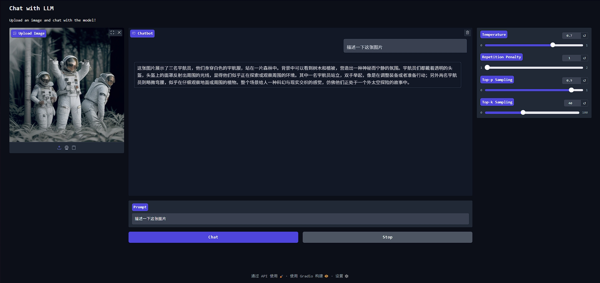

# AX-LLM


| Platform | Build Status |
| -------- | ------------ |
| AX650    | |

## 简介

**AX-LLM** 由 **[爱芯元智](https://www.axera-tech.com/)** 主导开发。该项目用于探索业界常用 **LLM(Large Language Model)** 在已有芯片平台上落地的可行性和相关能力边界，**方便**社区开发者进行**快速评估**和**二次开发**自己的 **LLM 应用**。

### 已支持芯片

- AX650A/AX650N
  - SDK ≥ v3.6.2
- AX630C
  - SDK ≥ v3.0.0

### 已支持模型

- InternVL2.5
- InternVL3

### 获取地址

- [Huggingface](https://huggingface.co/AXERA-TECH)
  - [InternVL3-1B](https://huggingface.co/AXERA-TECH/InternVL3-1B) 
  - [InternVL3-2B](https://huggingface.co/AXERA-TECH/InternVL3-2B)

## 源码编译

- 在 Host 上下载 axcl llm 对应分支
    ```shell
    git clone -b ax-internvl https://github.com/AXERA-TECH/ax-llm.git
    cd ax-llm
    ```
- 本地编译
    ```shell
    mkdir build
    cd build
    cmake ..
    make install -j4
    ```
- 正确编译后，`build/install/bin` 目录
  ```
  $ tree install/bin/
    install/bin/
    ├── main
    ├── run_bf16.sh
    └── run_qwen_1.8B.sh
  ```
  其中 `main` 就是 Huggingface 仓库中对应的 `main_ax650`
  
## 运行示例

### InternVL-3

```shell
./run_internvl_3_2b_448.sh 
[I][                            Init][ 134]: LLM init start
[I][                            Init][  34]: connect http://10.126.33.124:12345 ok
bos_id: -1, eos_id: 151645
img_start_token: 151665
img_context_token: 151667
100% | ████████████████████████████████ |  31 /  31 [12.41s<12.41s, 2.50 count/s] init post axmodel ok,remain_cmm(8233 MB)
[I][                            Init][ 226]: IMAGE_CONTEXT_TOKEN: 151667, IMAGE_START_TOKEN: 151665
[I][                            Init][ 251]: image encoder input nchw@float32
[I][                            Init][ 281]: image encoder output float32

[I][                            Init][ 291]: image_encoder_height : 448, image_encoder_width: 448
[I][                            Init][ 293]: max_token_len : 2559
[I][                            Init][ 296]: kv_cache_size : 256, kv_cache_num: 2559
[I][                            Init][ 304]: prefill_token_num : 128
[I][                            Init][ 308]: grp: 1, prefill_max_token_num : 1
[I][                            Init][ 308]: grp: 2, prefill_max_token_num : 128
[I][                            Init][ 308]: grp: 3, prefill_max_token_num : 256
[I][                            Init][ 308]: grp: 4, prefill_max_token_num : 384
[I][                            Init][ 308]: grp: 5, prefill_max_token_num : 512
[I][                            Init][ 308]: grp: 6, prefill_max_token_num : 640
[I][                            Init][ 308]: grp: 7, prefill_max_token_num : 768
[I][                            Init][ 308]: grp: 8, prefill_max_token_num : 896
[I][                            Init][ 308]: grp: 9, prefill_max_token_num : 1024
[I][                            Init][ 308]: grp: 10, prefill_max_token_num : 1152
[I][                            Init][ 308]: grp: 11, prefill_max_token_num : 1280
[I][                            Init][ 308]: grp: 12, prefill_max_token_num : 1408
[I][                            Init][ 308]: grp: 13, prefill_max_token_num : 1536
[I][                            Init][ 308]: grp: 14, prefill_max_token_num : 1664
[I][                            Init][ 308]: grp: 15, prefill_max_token_num : 1792
[I][                            Init][ 308]: grp: 16, prefill_max_token_num : 1920
[I][                            Init][ 308]: grp: 17, prefill_max_token_num : 2048
[I][                            Init][ 312]: prefill_max_token_num : 2048
[I][                     load_config][ 282]: load config: 
{
    "enable_repetition_penalty": false,
    "enable_temperature": false,
    "enable_top_k_sampling": true,
    "enable_top_p_sampling": false,
    "penalty_window": 20,
    "repetition_penalty": 1.2,
    "temperature": 0.9,
    "top_k": 1,
    "top_p": 0.8
}

[I][                            Init][ 321]: LLM init ok
Type "q" to exit, Ctrl+c to stop current running
prompt >> 描述一下这张图片
image >> image.png
[I][                          Encode][ 415]: image encode time : 403.51 ms, size : 393216
[I][                          Encode][ 524]: idx:0 offset : 49 out_embed.size() : 477696
[I][                             Run][ 551]: input token num : 311, prefill_split_num : 3
[I][                             Run][ 566]: prefill grpid 4
[I][                             Run][ 593]: input_num_token:128
[I][                             Run][ 593]: input_num_token:128
[I][                             Run][ 593]: input_num_token:55
[I][                             Run][ 717]: ttft: 1330.75 ms
这张图片展示了三名宇航员站在一片森林中。他们穿着白色的宇航服，头戴透明的头盔，头盔的镜片反射出周围的环境。宇航员们似乎处于一种放松或沉思的状态，其中一人双手举起，另一人弯腰，第三个人则站立着。背景是一片茂密的森林，树木和植被显得非常茂盛，营造出一种神秘而宁静的氛围。整个画面色调偏暗，给人一种神秘和未来感的视觉效果。

[N][                             Run][ 826]: hit eos,avg 11.15 token/s
```
### InternVL-3 web demo



## Reference

- [InternVL-3](https://huggingface.co/OpenGVLab/InternVL3-2B)
- [InternVL-2.5](https://huggingface.co/OpenGVLab/InternVL2_5-1B)

## 技术讨论

- Github issues
- QQ 群: 139953715

